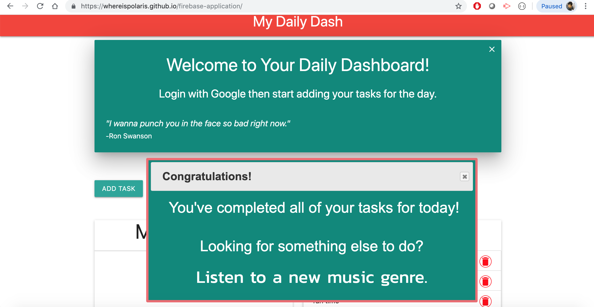

# Updated-Portfolio
Homework-8
1.	Project 1: My Daily Dash
This was our first group project where were created an app for user's daily activities. 
The purpose of this project was to give user an app for their routine management so that 
they can accomplish their daily goal on time. 

 
Another interesting fact about the project was to give user rewards points if they achieve their goal on time. 
We used firebase database and google authentication for user's data management. Managing data on firebase and providing log in information to user's identity were the most challenging parts of this project. 
However, several hours of rigorous of work team members achieved these goals and we feel very proud of our teamwork.
 
 
2.	Train Scheduler: This was another interesting project that I worked on to display the time schedule of any train system. 

 
I utilized JavaScript, jQuery and Moment.js to achieve this goal. 
Working with moment.js was another interesting fact that I learned during this project. 
Most Challenging part of this project was to set up time updates of the train schedule which i achieved with moment.js. 
 
3.	Gif Tastic: This was my best project and i feel so proud that I achieved this goal. 
Although, it was a bit challenging, i am happy to show that hard work let us accomplish our goal. 
Getting the Json data and implementing it with my project with associated key were very difficult to achieve. 
However, the knowledge that I gained during my course work at UT Austin coding Bootcamp help to attain those goal. 

